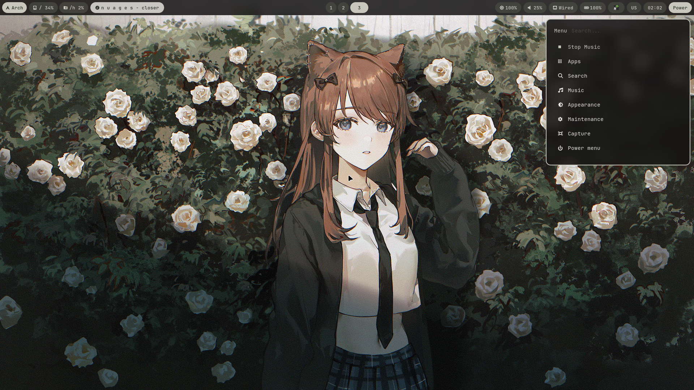
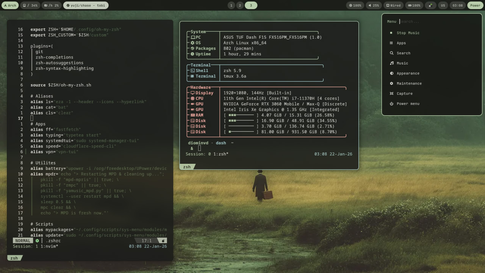
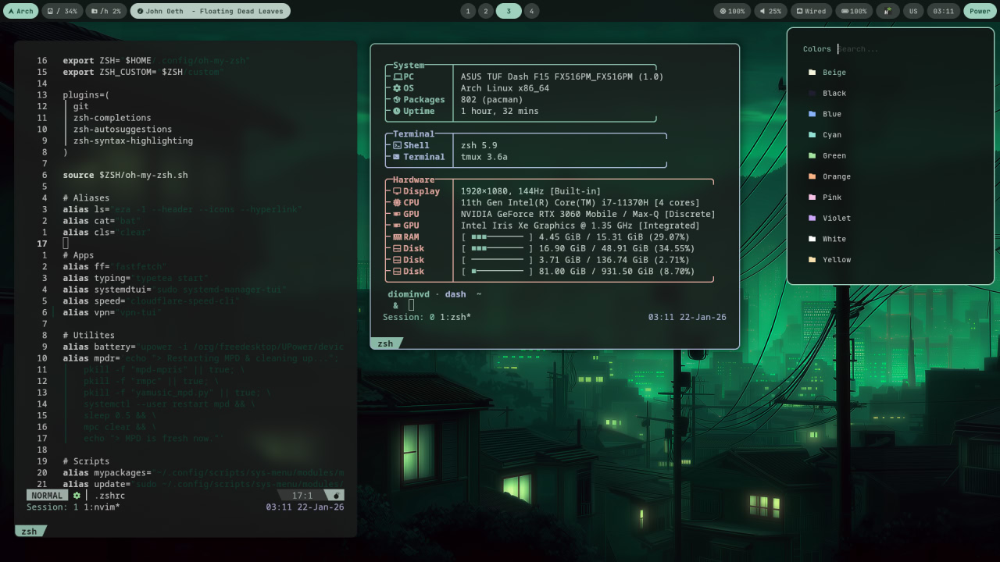
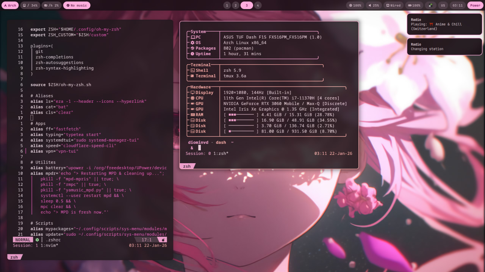
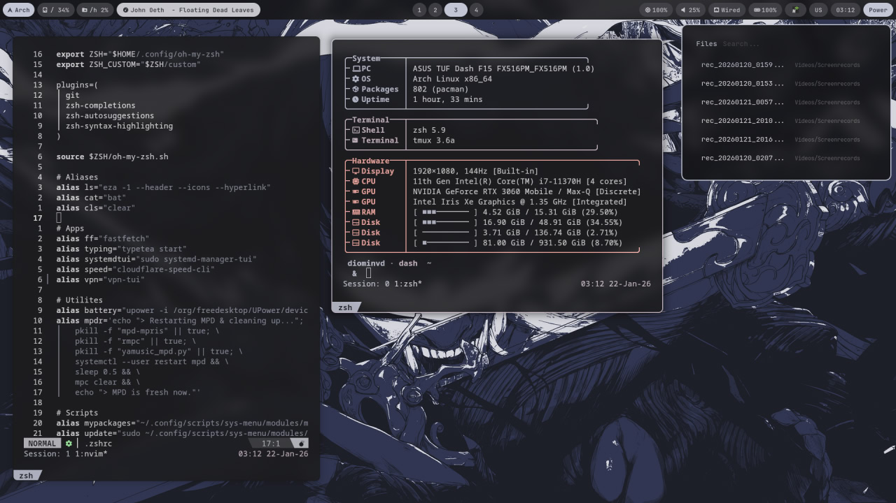

<div align="center">

# vibegen-dots


Configuration for the Hyprland desktop environment with an adaptive color palette configuration based on the desktop wallpaper.

[Gallery](#gallery) • [Components](#components) • [Features](#features) • [Installation](#installation) • [TODO](#todo) • [LICENSE](#license)



</div>

---

> [!WARNING]
> This repository is a personal configuration for your personal computer. The author is not responsible for the consequences of using files from this repository.

## Gallery

| &nbsp; | &nbsp; |
| :---: | :---: |
|  |  |
|  |  |

## Components

- **Window manager:** [`Hyprland`](https://hyprland.org) (Wayland)
- **Status bar:** [`Waybar`](https://github.com/Alexays/Waybar) with dynamic styles
- **Palette:** [`Matugen`](https://github.com/InioX/matugen) (Material You for Linux)
- **Notifications:** [`Mako`](https://github.com/emersion/mako)
- **Lockscreen:** [`Hyprlock`](https://wiki.hyprland.org/Hypr-ecosystem/hyprlock/)

## Features

- **Adaptive color palette:** All system colors (Waybar, Rofi, Mako, Kitty) sync with your wallpaper.
- **Advanced System Menu (Rofi)[^1]:**
  - **Apps:** Quick launcher.
  - **Search:** Search for files by name.
  - **Music:** Radio streams (Lofi, Synthwave, etc.) & Yandex Music integration.
  - **Appearance:** Instant wallpaper & theme switching.
  - **Maintenance:** Fast MPD/System service resets.
  - **Capture:** Screen recording with and fullscreen screenshot.
  - **Power menu:** Session management.
- **Stow:** Using stow for easy storage and conifurcation management.
- **TUI:** A unique combination of design and application with a TUI interface.

[^1]: Use the left and right keys to navigate through rofi.

## Dependencies

<details>
<summary>Core & Compositor</summary>

* `wayland` — Display server protocol.
* `hyprland` — Main dynamic tiling Wayland compositor.
* `hyprctl` — CLI tool to control Hyprland parameters at runtime.
* `xdg-desktop-portal-hyprland` — Backend for screenshots and screen sharing.
* `qt5-wayland` / `qt6-wayland` — Wayland support for Qt applications.
* `stow` — Symlink farm manager (dotfiles management).
* `systemd-manager-tui` — TUI for managing systemd services.

</details>

<details>
<summary>UI & Appearance</summary>

* `waybar` — Highly customizable status bar.
* `rofi` — Window switcher, application launcher, and dmenu replacement.
* `mako` — Lightweight notification daemon.
* `swww` — Solution for animated wallpapers.
* `matugen` — Material You color scheme generator.
* `hyprlock` — Modern screen locker.
* `adw-gtk-theme` — Adaptive GTK theme (Libadwaita style).
* `kvantum` / `kvantum-qt5` — SVG-based theme engine for Qt.
* `ttf-jetbrains-mono-nerd` — Primary font with integrated icons.

</details>

<details>
<summary>Terminal & Shell</summary>

* `kitty` — GPU-accelerated terminal emulator.
* `zsh` / `oh-my-zsh` — Main shell with extended plugin framework.
* `starship` — Fast, customizable cross-shell prompt.
* `tmux` — Terminal multiplexer for managing sessions and panes.
* `fastfetch` — System information display tool.
* `eza` — Modern and feature-rich replacement for `ls`.
* `bat` — A `cat` clone with syntax highlighting and git integration.

</details>

<details>
<summary>Development & Utils</summary>

* `neovim` / `zed` — Core text editors (TUI & GUI).
* `python` / `python-pip` — Python environment and package manager.
* `ripgrep` — Fast line-oriented search tool.
* `bc` — Arbitrary precision calculator language.
* `fzf` — Command-line fuzzy finder.
* `gum` — Tool for glamorous interactive shell scripts.
* `yay` — Yet another Yogurt: an AUR helper.

</details>

<details>
<summary>File Management & Graphics</summary>

* `thunar` — Intuitive graphical file manager.
* `imv` — Image viewer for Wayland.
* `grim` / `slurp` — Screenshot utility (full screen / region).
* `wf-recorder` — Screen recording tool for Wayland.
* `wl-copy` — Wayland clipboard utilities (copy/paste).

</details>

<details>
<summary>Multimedia & Sound</summary>

* `mpd` / `mpc` / `rmpc` — Music Player Daemon and its clients.
* `mpd-mpris` — MPRIS bridge for MPD.
* `playerctl` — Media player controller (MPRIS).
* `wpctl` — PipeWire wireplumber control utility.
* `wiremix` — Audio mixer for Wayland.

</details>

<details>
<summary>Networking & Hardware</summary>

* `zen-browser` — Main web browser (Firefox-based).
* `wifitui` / `bluetuith` — TUI for managing Wi-Fi and Bluetooth.
* `cloudflare-speed-cli` — CLI for Cloudflare speed test.
* `brightnessctl` — Control device backlight and LEDs.
* `btop` / `powertop` — Resource and power consumption monitoring.
* `pacman-contrib` — Scripts and tools for pacman (paccache).

</details>

## Installation

> [!WARNING]
> Before installing dependencies, be sure to study the way they are installed on your distribution and the issue of compatibility with your hardware.

1. Create backup of your configuration
```
cp -r ~/.config ~/.config_backup
```

2. Install all dependencies from [dependencies](#dependencies) list.

3. Create the necessary directories.
```
mkdir -p ~/Pictures/Wallpapers
mkdir -p ~/Videos/Screenrecords
mkdir ~/Music
```

4. Copy the repository and move it to your home directory, renaming it along the way.
```
git clone https://github.com/diominvd/vibegen-dots.git
mv chameleon-rice ~/.dotfiles
cd ~/.dotfiles
```

5. Before using stow, you need to delete your old files from the `~/.config` directory. You can check the list of these files by viewing the directory tree `~/.dotfiles`. 

6. Use the stow utility to create symbolic links in the desired directories.
```
stow -v -t ~ fastfetch gtk-3.0 gtk-4.0 hypr kitty matugen mpd nvim rofi scripts tmux wallpapers waybar zed zen-browser zsh
```

## TODO

[ ] Fix the display of clean script.

[ ] Add a modular structure for the waybar configuration.

---

## License

This project is licensed under the [MIT License](LICENSE).
